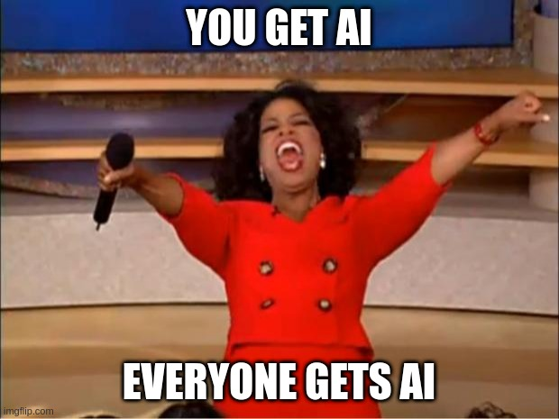

<!-- TOC -->
  * [Harnessing AI in the Role of a Security Practitioner](#harnessing-ai-in-the-role-of-a-security-practitioner)
    * [The Collaborative Nature of AI and SOC Analysts](#the-collaborative-nature-of-ai-and-soc-analysts)
    * [AI-Driven SIEMs: A Safer Approach](#ai-driven-siems-a-safer-approach)
    * [Striking the Balance: AI Assistance and Human Judgment](#striking-the-balance-ai-assistance-and-human-judgment)
    * [Conclusion](#conclusion)
<!-- TOC -->

Thanks to the generosity of [Devo](https://devo.com) I was able to attend BlackHat this year.  This year's theme was AI evidently because everyone was doing something with AI.

# AI as a theme

This was EVERYWHERE at BlackHat so I should probably ramp up on it pretty quick

## Harnessing AI in the Role of a Security Practitioner

In the ever-evolving landscape of cybersecurity, the integration of Artificial Intelligence (AI) has emerged as a game-changer, augmenting the capabilities of security practitioners. While some fear that AI might replace human analysts, there's a growing consensus that AI serves as a valuable ally rather than a replacement.  For more information check out this [article](https://www.shecancode.io/blog/ai-is-your-ally-not-your-enemy). Several AI-driven products have demonstrated their effectiveness in enhancing security operations without diminishing the role of Security Operations Center (SOC) analysts. One such application is in Security Information and Event Management (SIEM) systems, where AI can be harnessed to mitigate risks associated with blind clicking and to foster more informed decision-making.

### The Collaborative Nature of AI and SOC Analysts

AI's role in the security domain is not about usurping human expertise but about augmenting it. AI has the capacity to analyze vast amounts of data at an unprecedented speed, helping SOC analysts identify patterns and anomalies that might go unnoticed through manual analysis alone. This collaboration between AI and analysts creates a synergy that strengthens the overall security posture.

### AI-Driven SIEMs: A Safer Approach

One noteworthy application of AI is in the context of SIEMs. Security Information and Event Management systems are the backbone of a robust cybersecurity infrastructure, aggregating and analyzing security data from various sources to detect and respond to threats. By incorporating AI into SIEMs, organizations can bolster their defense mechanisms against evolving cyber threats.

One particular challenge that AI addresses in SIEMs is the issue of analysts blindly agreeing with AI-generated decisions. This situation can potentially arise when AI flags an alert or suggests a course of action, leading analysts to trust AI blindly without further investigation. To mitigate this risk, the implementation of AI should focus on providing context and explanations for its decisions. When an AI-driven alert is generated, it should be accompanied by relevant data points, reasons for its classification, and an explanation of the potential impact. This empowers analysts to make well-informed decisions based on both AI insights and their expertise.

### Striking the Balance: AI Assistance and Human Judgment

AI augments the capabilities of SOC analysts by sifting through vast data streams, detecting anomalies, and highlighting potential threats. This allows analysts to allocate their time and energy towards more complex tasks that require human judgment, creativity, and contextual understanding. Instead of replacing analysts, AI frees them from monotonous and time-consuming tasks, enabling them to focus on proactive threat hunting, strategy development, and incident response.

### Conclusion

The partnership between AI and security practitioners marks a new era in cybersecurity. AI's ability to process and analyze data at scale, coupled with the intuition and expertise of human analysts, creates a formidable defense against a wide array of cyber threats. In the context of SIEMs, AI-driven insights can significantly enhance the efficiency and effectiveness of security operations while ensuring that analysts remain central to the decision-making process.